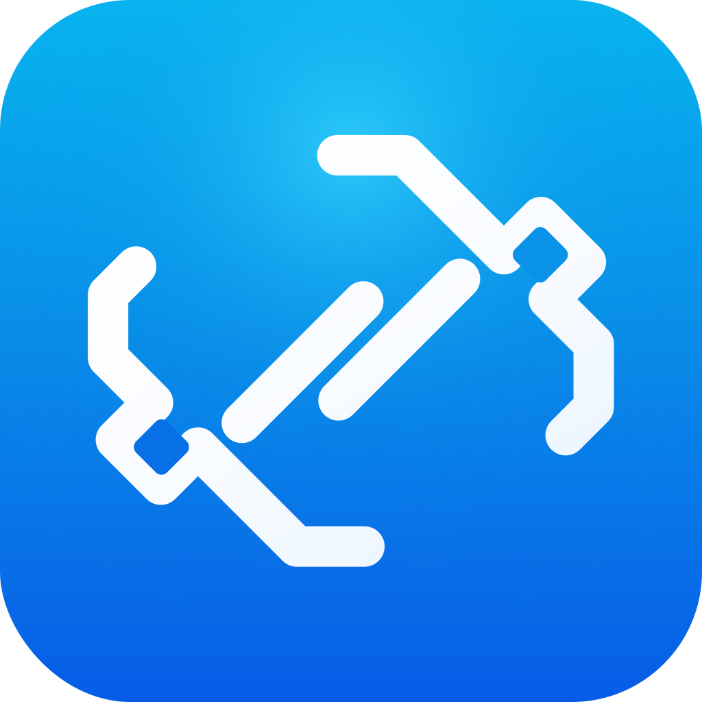
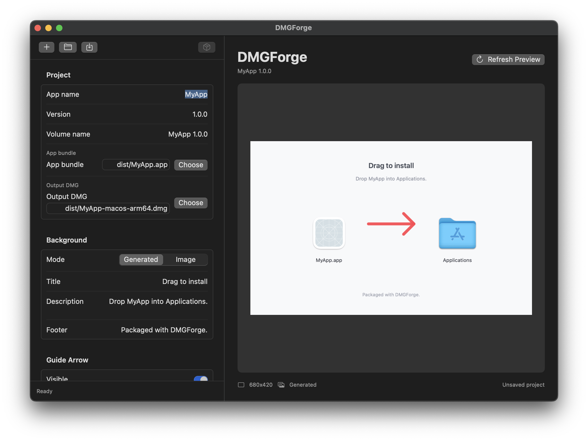

# DMGForge

<p align="center">
  
</p>

DMGForge is a small macOS app for making polished drag-to-install `.dmg` installers.

It is built for the moment after your app is done and you want a clean installer without hand-tuning Finder windows over and over. You can use it yourself in the app, or let Codex, Claude, or another coding agent call the CLI and open the real mounted DMG for you to review.

## What You Can Do

- Package a macOS `.app` into a drag-to-install `.dmg`
- Use the default installer look with no design work
- Edit the title, description, footer, app positions, and install arrow
- Use your own background image
- Preview quickly as a PNG
- Open the actual mounted DMG to see exactly what users will see
- Let an agent create, tweak, and rebuild the installer from your app repo

## App Preview

<p align="center">
  
</p>

## The Basic Flow

1. Build your macOS app.
2. Create a DMGForge project for it.
3. Review the real mounted installer window.
4. Tweak the copy, background image, arrow, or layout if needed.
5. Export the final `.dmg`.

The review step is intentionally real: DMGForge can build the DMG and open it in Finder, so you are approving the actual mounted installer rather than guessing from a mockup.

## Using the App

Build DMGForge, then open `DMGForge.app`.

```bash
scripts/build.sh
open dist/DMGForge.app
```

From the app you can choose the app bundle, output location, background style, installer text, icon positions, and guide arrow settings.

If you want DMGForge installed like a normal app:

```bash
ditto dist/DMGForge.app /Applications/DMGForge.app
```

## Using the CLI

DMGForge also includes a CLI called `dmgforge`. This is the best entrypoint for coding agents because it is easy to call from any app repo.

Create a project:

```bash
dmgforge init --app dist/MyApp.app --name MyApp --version 1.0.0 --output packaging/MyApp.dmgproject
```

Open the real DMG for review:

```bash
dmgforge review packaging/MyApp.dmgproject
```

Change the installer text:

```bash
dmgforge copy packaging/MyApp.dmgproject --description "Drag MyApp into Applications."
```

Use a custom background image:

```bash
dmgforge background packaging/MyApp.dmgproject --image assets/dmg-background.png
```

Hide or customize the guide arrow:

```bash
dmgforge arrow packaging/MyApp.dmgproject --hide
dmgforge arrow packaging/MyApp.dmgproject --show --color "#FFFFFF" --thickness 5
```

Export the final DMG:

```bash
dmgforge export packaging/MyApp.dmgproject
```

## Installing the CLI

After putting `DMGForge.app` in `/Applications`, install the CLI shortcut:

```bash
sudo scripts/install-cli.sh
dmgforge help
```

This creates `/usr/local/bin/dmgforge`, so humans and agents can use the same command.

## Agent-Friendly Review

A typical Codex prompt can be as simple as:

> Use `dmgforge` to package this app and open the DMG for review.

Then, after the DMG opens, you can keep iterating:

> Use the image I attached as the DMG background.

> Change the description to "Drop the app into Applications to install."

> Hide the arrow and open the DMG again.

DMGForge stores those choices in a small `.dmgproject` file inside your repo, so the installer can be rebuilt consistently later.

## Local Development

Requirements:

- macOS 13 or newer
- Xcode command line tools
- Swift 6

Useful commands:

```bash
swift test
swift build
swift run dmgforge help
```

Build a release app bundle:

```bash
scripts/build.sh
```

Build DMGForge's own installer project:

```bash
scripts/build.sh --dmg
```

Project files are JSON and are meant to stay readable enough for both people and agents.
